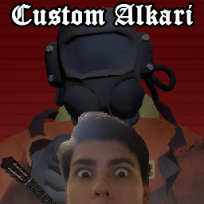

# Custom Alkari

<h3 style="margin-top: 10px;">This is a mod for Lethal Company that can make your playing MORE FUN!</h3>

## Requirements

This mod requires:  
[BepInEx](https://thunderstore.io/package/bbepis/BepInExPack) | [Evaisa-LethalLib](https://thunderstore.io/c/lethal-company/p/Evaisa/LethalLib) | [Evaisa-HookGenPatcher](https://thunderstore.io/c/lethal-company/p/Evaisa/HookGenPatcher) 

#

## Have the funniest game ever!

>Alkari is a derivative of the Russian word АЛКАШИ, which means drunks.